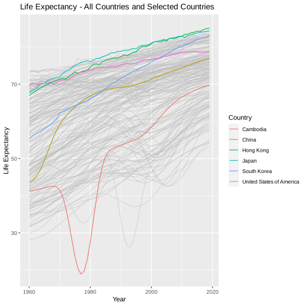
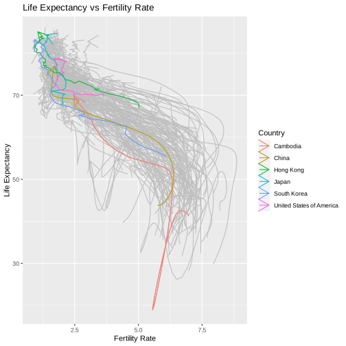
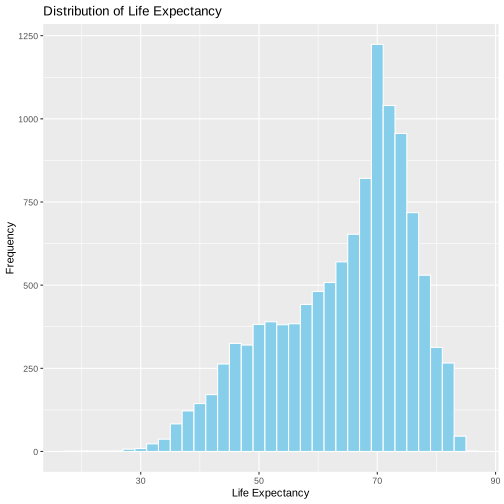

## Life Expectancy Across Countries Prediction


In this case, we will do data exploration and multiple regression to explain, and model life expectancy across countries using gapminder data.

The data file contains the following variables:
* name : country name
* iso3 : 3-letter country code
* iso2 : 2-letter country code
* region : broad geographic region, also loosely called as “continent” below.
* sub-region : more precise region
* intermediate-region
* time : year. I recommend renaming this to “year” instead because I always mess it up.
* totalPopulation : total population
* GDP_PC : GDP per capita (constant 2010 US$)
* accessElectricity : Access to electricity (% of population)
* agriculturalLand : Agricultural land (sq. km)
* agricultureTractors : Agricultural machinery, tractors (count)
* cerealProduction : Cereal production (metric tons)
* feritilizerHa : Fertilizer consumption (kilograms per hectare of arable land)
* fertilityRate : total fertility rate (births per woman)
* lifeExpectancy : Life expectancy at birth, total (years)
* childMortality : Mortality rate, under-5 (per 1,000 live births)
* youthFemaleLiteracy : Literacy rate, youth female (% of females ages 15-24)
* youthMaleLiteracy : Literacy rate, youth male (% of males ages 15-24)
* adultLiteracy : Literacy rate, adult total (% of people ages 15 and above)
* co2 : CO2 emissions (kt)
* greenhouseGases : Total greenhouse gas emissions (kt of CO2 equivalent)
* co2_PC : CO2 emissions (metric tons per capita)
* pm2.5_35 : PM2.5 pollution, population


To begin, let's identify what is life expectancy: Period life expectancies use mortality rates from a single year (or group of years) and assume that those rates apply throughout the remainder of a person's life. This means that any future changes to mortality rates would not be taken into account.It is a eeasier way to predict life expectancies.
source: office for national statistics, census
https://www.ons.gov.uk/peoplepopulationandcommunity/birthsdeathsandmarriages/lifeexpectancies/methodologies/periodandcohortlifeexpectancyexplained

# Load and clean the data

After reading the file, I did the data cleaning for this data frame. After cleaning, there are 11618 obs in total.
1. Remove all cases with missing life expectancy, year, and country name or code.
2. Change the country name from "Korea, Republic of" to "South Korea"


```R
library("tidyverse")
```


```R
gapminder<- read.delim("gapminder.csv.bz2")
gapminder <- gapminder %>%
  filter(!is.na(lifeExpectancy), !is.na(time), !is.na(name))%>%
  filter(name!="")%>%
  mutate(name = ifelse(name == "Korea, Republic of", "South Korea", name))
```

# Brief data exploration and findings
1. There are countries 204 countries in the gapminder data frame

2. The first and last year with valid life expectancy data is 1960 and the Last year is 2019.

3. The lowest and highest life expectancy values are:
Life expectancy min:18.907, year=1977, Country=Cambodia
Life expectancy max:85.417, year=2012, Country=San Marino

4. The lowest life expectancy was in Cambodia in 1977.
That is because nearly two million people died under the rule of the fanatical Communist movement, which imposed a ruthless agenda of forced labor, thought control, and mass execution on Cambodia. 
source: https://www.ushmm.org/genocide-prevention/countries/cambodia/cambodia-1975


```R
length(unique(gapminder$name))
range(gapminder$time)
head(gapminder[gapminder$time ==1960,])
head(gapminder[gapminder$time==2019,])

range(gapminder$lifeExpectancy)
gapminder[gapminder$lifeExpectancy ==18.90700,]
gapminder[gapminder$lifeExpectancy==85.41707,]
```


204


<style>
.list-inline {list-style: none; margin:0; padding: 0}
.list-inline>li {display: inline-block}
.list-inline>li:not(:last-child)::after {content: "\00b7"; padding: 0 .5ex}
</style>
<ol class=list-inline><li>1960</li><li>2019</li></ol>


<table class="dataframe">
<caption>A data.frame: 6 × 25</caption>
<thead>
	<tr><th></th><th scope=col>iso3</th><th scope=col>name</th><th scope=col>iso2</th><th scope=col>region</th><th scope=col>sub.region</th><th scope=col>intermediate.region</th><th scope=col>time</th><th scope=col>totalPopulation</th><th scope=col>fertilityRate</th><th scope=col>lifeExpectancy</th><th scope=col>⋯</th><th scope=col>accessElectricity</th><th scope=col>agriculturalLand</th><th scope=col>agricultureTractors</th><th scope=col>cerealProduction</th><th scope=col>fertilizerHa</th><th scope=col>co2</th><th scope=col>greenhouseGases</th><th scope=col>co2_PC</th><th scope=col>pm2.5_35</th><th scope=col>battleDeaths</th></tr>
	<tr><th></th><th scope=col>&lt;chr&gt;</th><th scope=col>&lt;chr&gt;</th><th scope=col>&lt;chr&gt;</th><th scope=col>&lt;chr&gt;</th><th scope=col>&lt;chr&gt;</th><th scope=col>&lt;chr&gt;</th><th scope=col>&lt;int&gt;</th><th scope=col>&lt;int&gt;</th><th scope=col>&lt;dbl&gt;</th><th scope=col>&lt;dbl&gt;</th><th scope=col>⋯</th><th scope=col>&lt;dbl&gt;</th><th scope=col>&lt;dbl&gt;</th><th scope=col>&lt;int&gt;</th><th scope=col>&lt;int&gt;</th><th scope=col>&lt;dbl&gt;</th><th scope=col>&lt;dbl&gt;</th><th scope=col>&lt;dbl&gt;</th><th scope=col>&lt;dbl&gt;</th><th scope=col>&lt;dbl&gt;</th><th scope=col>&lt;int&gt;</th></tr>
</thead>
<tbody>
	<tr><th scope=row>1</th><td>ABW</td><td>Aruba               </td><td>AW</td><td>Americas</td><td>Latin America and the Caribbean</td><td>Caribbean    </td><td>1960</td><td>   54211</td><td>4.820</td><td>65.662</td><td>⋯</td><td>NA</td><td>NA</td><td>NA</td><td>NA</td><td>NA</td><td>11092.675</td><td>NA</td><td>204.62037</td><td>NA</td><td>NA</td></tr>
	<tr><th scope=row>61</th><td>AFG</td><td>Afghanistan         </td><td>AF</td><td>Asia    </td><td>Southern Asia                  </td><td>             </td><td>1960</td><td> 8996973</td><td>7.450</td><td>32.446</td><td>⋯</td><td>NA</td><td>NA</td><td>NA</td><td>NA</td><td>NA</td><td>  414.371</td><td>NA</td><td>  0.04606</td><td>NA</td><td>NA</td></tr>
	<tr><th scope=row>121</th><td>AGO</td><td>Angola              </td><td>AO</td><td>Africa  </td><td>Sub-Saharan Africa             </td><td>Middle Africa</td><td>1960</td><td> 5454933</td><td>6.708</td><td>37.524</td><td>⋯</td><td>NA</td><td>NA</td><td>NA</td><td>NA</td><td>NA</td><td>  550.050</td><td>NA</td><td>  0.10084</td><td>NA</td><td>NA</td></tr>
	<tr><th scope=row>181</th><td>ALB</td><td>Albania             </td><td>AL</td><td>Europe  </td><td>Southern Europe                </td><td>             </td><td>1960</td><td> 1608800</td><td>6.489</td><td>62.283</td><td>⋯</td><td>NA</td><td>NA</td><td>NA</td><td>NA</td><td>NA</td><td> 2024.184</td><td>NA</td><td>  1.25819</td><td>NA</td><td>NA</td></tr>
	<tr><th scope=row>241</th><td>ARE</td><td>United Arab Emirates</td><td>AE</td><td>Asia    </td><td>Western Asia                   </td><td>             </td><td>1960</td><td>   92418</td><td>6.929</td><td>51.537</td><td>⋯</td><td>NA</td><td>NA</td><td>NA</td><td>NA</td><td>NA</td><td>   11.001</td><td>NA</td><td>  0.11904</td><td>NA</td><td>NA</td></tr>
	<tr><th scope=row>301</th><td>ARG</td><td>Argentina           </td><td>AR</td><td>Americas</td><td>Latin America and the Caribbean</td><td>South America</td><td>1960</td><td>20481779</td><td>3.109</td><td>65.055</td><td>⋯</td><td>NA</td><td>NA</td><td>NA</td><td>NA</td><td>NA</td><td>48815.104</td><td>NA</td><td>  2.38334</td><td>NA</td><td>NA</td></tr>
</tbody>
</table>


<table class="dataframe">
<caption>A data.frame: 6 × 25</caption>
<thead>
	<tr><th></th><th scope=col>iso3</th><th scope=col>name</th><th scope=col>iso2</th><th scope=col>region</th><th scope=col>sub.region</th><th scope=col>intermediate.region</th><th scope=col>time</th><th scope=col>totalPopulation</th><th scope=col>fertilityRate</th><th scope=col>lifeExpectancy</th><th scope=col>⋯</th><th scope=col>accessElectricity</th><th scope=col>agriculturalLand</th><th scope=col>agricultureTractors</th><th scope=col>cerealProduction</th><th scope=col>fertilizerHa</th><th scope=col>co2</th><th scope=col>greenhouseGases</th><th scope=col>co2_PC</th><th scope=col>pm2.5_35</th><th scope=col>battleDeaths</th></tr>
	<tr><th></th><th scope=col>&lt;chr&gt;</th><th scope=col>&lt;chr&gt;</th><th scope=col>&lt;chr&gt;</th><th scope=col>&lt;chr&gt;</th><th scope=col>&lt;chr&gt;</th><th scope=col>&lt;chr&gt;</th><th scope=col>&lt;int&gt;</th><th scope=col>&lt;int&gt;</th><th scope=col>&lt;dbl&gt;</th><th scope=col>&lt;dbl&gt;</th><th scope=col>⋯</th><th scope=col>&lt;dbl&gt;</th><th scope=col>&lt;dbl&gt;</th><th scope=col>&lt;int&gt;</th><th scope=col>&lt;int&gt;</th><th scope=col>&lt;dbl&gt;</th><th scope=col>&lt;dbl&gt;</th><th scope=col>&lt;dbl&gt;</th><th scope=col>&lt;dbl&gt;</th><th scope=col>&lt;dbl&gt;</th><th scope=col>&lt;int&gt;</th></tr>
</thead>
<tbody>
	<tr><th scope=row>60</th><td>ABW</td><td>Aruba               </td><td>AW</td><td>Americas</td><td>Latin America and the Caribbean</td><td>Caribbean    </td><td>2019</td><td>  106314</td><td>1.901</td><td>76.293</td><td>⋯</td><td>100.00000</td><td>NA</td><td>NA</td><td>NA</td><td>NA</td><td>NA</td><td>NA</td><td>NA</td><td>NA</td><td>   NA</td></tr>
	<tr><th scope=row>120</th><td>AFG</td><td>Afghanistan         </td><td>AF</td><td>Asia    </td><td>Southern Asia                  </td><td>             </td><td>2019</td><td>38041754</td><td>4.321</td><td>64.833</td><td>⋯</td><td> 97.70000</td><td>NA</td><td>NA</td><td>NA</td><td>NA</td><td>NA</td><td>NA</td><td>NA</td><td>NA</td><td>29940</td></tr>
	<tr><th scope=row>180</th><td>AGO</td><td>Angola              </td><td>AO</td><td>Africa  </td><td>Sub-Saharan Africa             </td><td>Middle Africa</td><td>2019</td><td>31825295</td><td>5.442</td><td>61.147</td><td>⋯</td><td> 45.67031</td><td>NA</td><td>NA</td><td>NA</td><td>NA</td><td>NA</td><td>NA</td><td>NA</td><td>NA</td><td>   25</td></tr>
	<tr><th scope=row>240</th><td>ALB</td><td>Albania             </td><td>AL</td><td>Europe  </td><td>Southern Europe                </td><td>             </td><td>2019</td><td> 2854191</td><td>1.597</td><td>78.573</td><td>⋯</td><td>100.00000</td><td>NA</td><td>NA</td><td>NA</td><td>NA</td><td>NA</td><td>NA</td><td>NA</td><td>NA</td><td>   NA</td></tr>
	<tr><th scope=row>300</th><td>ARE</td><td>United Arab Emirates</td><td>AE</td><td>Asia    </td><td>Western Asia                   </td><td>             </td><td>2019</td><td> 9770529</td><td>1.387</td><td>77.972</td><td>⋯</td><td>100.00000</td><td>NA</td><td>NA</td><td>NA</td><td>NA</td><td>NA</td><td>NA</td><td>NA</td><td>NA</td><td>   NA</td></tr>
	<tr><th scope=row>360</th><td>ARG</td><td>Argentina           </td><td>AR</td><td>Americas</td><td>Latin America and the Caribbean</td><td>South America</td><td>2019</td><td>44938712</td><td>2.247</td><td>76.667</td><td>⋯</td><td>100.00000</td><td>NA</td><td>NA</td><td>NA</td><td>NA</td><td>NA</td><td>NA</td><td>NA</td><td>NA</td><td>   NA</td></tr>
</tbody>
</table>


<style>
.list-inline {list-style: none; margin:0; padding: 0}
.list-inline>li {display: inline-block}
.list-inline>li:not(:last-child)::after {content: "\00b7"; padding: 0 .5ex}
</style>
<ol class=list-inline><li>18.907</li><li>85.41707</li></ol>


<table class="dataframe">
<caption>A data.frame: 1 × 25</caption>
<thead>
	<tr><th></th><th scope=col>iso3</th><th scope=col>name</th><th scope=col>iso2</th><th scope=col>region</th><th scope=col>sub.region</th><th scope=col>intermediate.region</th><th scope=col>time</th><th scope=col>totalPopulation</th><th scope=col>fertilityRate</th><th scope=col>lifeExpectancy</th><th scope=col>⋯</th><th scope=col>accessElectricity</th><th scope=col>agriculturalLand</th><th scope=col>agricultureTractors</th><th scope=col>cerealProduction</th><th scope=col>fertilizerHa</th><th scope=col>co2</th><th scope=col>greenhouseGases</th><th scope=col>co2_PC</th><th scope=col>pm2.5_35</th><th scope=col>battleDeaths</th></tr>
	<tr><th></th><th scope=col>&lt;chr&gt;</th><th scope=col>&lt;chr&gt;</th><th scope=col>&lt;chr&gt;</th><th scope=col>&lt;chr&gt;</th><th scope=col>&lt;chr&gt;</th><th scope=col>&lt;chr&gt;</th><th scope=col>&lt;int&gt;</th><th scope=col>&lt;int&gt;</th><th scope=col>&lt;dbl&gt;</th><th scope=col>&lt;dbl&gt;</th><th scope=col>⋯</th><th scope=col>&lt;dbl&gt;</th><th scope=col>&lt;dbl&gt;</th><th scope=col>&lt;int&gt;</th><th scope=col>&lt;int&gt;</th><th scope=col>&lt;dbl&gt;</th><th scope=col>&lt;dbl&gt;</th><th scope=col>&lt;dbl&gt;</th><th scope=col>&lt;dbl&gt;</th><th scope=col>&lt;dbl&gt;</th><th scope=col>&lt;int&gt;</th></tr>
</thead>
<tbody>
	<tr><th scope=row>5580</th><td>KHM</td><td>Cambodia</td><td>KH</td><td>Asia</td><td>South-eastern Asia</td><td></td><td>1977</td><td>7196042</td><td>5.557</td><td>18.907</td><td>⋯</td><td>NA</td><td>25500</td><td>1233</td><td>1080000</td><td>NA</td><td>73.34</td><td>11996.91</td><td>0.01019</td><td>NA</td><td>NA</td></tr>
</tbody>
</table>


<table class="dataframe">
<caption>A data.frame: 1 × 25</caption>
<thead>
	<tr><th></th><th scope=col>iso3</th><th scope=col>name</th><th scope=col>iso2</th><th scope=col>region</th><th scope=col>sub.region</th><th scope=col>intermediate.region</th><th scope=col>time</th><th scope=col>totalPopulation</th><th scope=col>fertilityRate</th><th scope=col>lifeExpectancy</th><th scope=col>⋯</th><th scope=col>accessElectricity</th><th scope=col>agriculturalLand</th><th scope=col>agricultureTractors</th><th scope=col>cerealProduction</th><th scope=col>fertilizerHa</th><th scope=col>co2</th><th scope=col>greenhouseGases</th><th scope=col>co2_PC</th><th scope=col>pm2.5_35</th><th scope=col>battleDeaths</th></tr>
	<tr><th></th><th scope=col>&lt;chr&gt;</th><th scope=col>&lt;chr&gt;</th><th scope=col>&lt;chr&gt;</th><th scope=col>&lt;chr&gt;</th><th scope=col>&lt;chr&gt;</th><th scope=col>&lt;chr&gt;</th><th scope=col>&lt;int&gt;</th><th scope=col>&lt;int&gt;</th><th scope=col>&lt;dbl&gt;</th><th scope=col>&lt;dbl&gt;</th><th scope=col>⋯</th><th scope=col>&lt;dbl&gt;</th><th scope=col>&lt;dbl&gt;</th><th scope=col>&lt;int&gt;</th><th scope=col>&lt;int&gt;</th><th scope=col>&lt;dbl&gt;</th><th scope=col>&lt;dbl&gt;</th><th scope=col>&lt;dbl&gt;</th><th scope=col>&lt;dbl&gt;</th><th scope=col>&lt;dbl&gt;</th><th scope=col>&lt;int&gt;</th></tr>
</thead>
<tbody>
	<tr><th scope=row>9449</th><td>SMR</td><td>San Marino</td><td>SM</td><td>Europe</td><td>Southern Europe</td><td></td><td>2012</td><td>32105</td><td>1.26</td><td>85.41707</td><td>⋯</td><td>100</td><td>10</td><td>NA</td><td>NA</td><td>NA</td><td>NA</td><td>NA</td><td>NA</td><td>NA</td><td>NA</td></tr>
</tbody>
</table>


# Countries' life expectancy over time plot
Next, let's plot the life expectancy over time for all countries (there are many of them).
Make a plot where you show life expectancy (y-axis) in each country versus time (x-axis). I plot all countries in grey and highlight the U.S., South Korea, Cambodia, Hong Kong, Japan and China on this graph.

Interpretation:

For the grey lines, we can see that the overall life expectancy in all countries have increased gradually with the time. There are many possible factors that may can explain this scenario. Economy development has grow rapidly to achieve longer life, healthy life style has become the trend for recent years and the improvement for the medical industry may be the reasons why life expectancy has increased.

For the colored lines, we can see that most developed countries, including Hong Kong, Japan and US have higher life expectancy compared with other countries and the life expectancy has increased as the time goes. 

On the other hand, South Korea used to have lower life expectancy during 1960-1980, i think this is because of the Korea War that happened in 1950s that caused the economy recession.

China has low life expectancy during 1960s and has gradually increased as their economy has improved during the past thirty years. 

Lastly, Combodia has the lowest life expectancy in 1977.
That is because nearly two million people died under the rule of the fanatical Communist movement, which imposed a ruthless agenda of forced labor, thought control, and mass execution on Cambodia. Even though their life expectancy has increased during the past few years, it is apparent that it is still lower compared to other countries.


```R
selected_countries <- c("United States of America", "South Korea", "Cambodia", "China", "Hong Kong", "Japan")
selected_country <- gapminder[gapminder$name %in% selected_countries, ]

ggplot() +
  geom_line(data = gapminder, aes(x = time, y = lifeExpectancy, group = name), color = "grey", alpha = 0.5) +
  geom_line(data = selected_country, aes(x = time, y = lifeExpectancy, group = name, color = name)) +
  labs(title = "Life Expectancy - All Countries and Selected Countries",
       x = "Year",
       y = "Life Expectancy",
       color = "Country")

```


    

    


# Life expectancy and fertility plot

Now, let’s examine how life expectancy and fertility are related. Make a fertility rate versus life expectancy plot of all countries with selected countries highlighted. I use arrows to mark which way the time goes on the figure.

Using geom_path can allow me to explore how two variables(fertilityRate and lifeExpectancy) are related over time, the arrow shows how the time flows

Interpretation:

According to the chart above, when the the life expectancy is low, the fertility rate is higher, this is usually happening in the early years which the sanitary condition is bad. I think when the health and medical condition is bad, people get sick and die easily, so they havee to make more babies to fulfill the labor market. As the medical condition improved nowadays (like how the arrow shows in the graph), the fertality rate has decreased and the life expectancy has increased.

When it comes to specific countries, Cambodia has a drop in life expectancy because nearly two million people died under the rule of the fanatical Communist movement, which imposed a ruthless agenda of forced labor, thought control, and mass execution on Cambodia.


```R
ggplot() +
  geom_path(data = gapminder, aes(x =fertilityRate, y = lifeExpectancy, group = name), color = "grey", alpha = 5, arrow=arrow()) +
  geom_path(data = selected_country, aes(x = fertilityRate, y =lifeExpectancy , group = name, color = name), arrow=arrow()) +
  labs(title = "Life Expectancy vs Fertility Rate",
       x = "Fertility Rate",
       y = "Life Expectancy",
       color = "Country")
```

    Warning message:
    “Removed 18 rows containing missing values (`geom_path()`).”


    

    


#  Distribution of life expectancy
 Display the distribution of life expectancy.

 The distribution here is left skewed.


```R
ggplot(gapminder, aes(x = lifeExpectancy)) +
  geom_histogram(binwidth = 2, fill = "skyblue", color = "white") +
  labs(title = "Distribution of Life Expectancy",
       x = "Life Expectancy",
       y = "Frequency") 
```


    

    


# Create a model to see how time affects the life expectancy

life expectancy = β0 + β1 · t
I use year − 2000 instead of just the year for time because we can to decrease the gap between year and life expectancy. 
I tried to do the model without -2000 in time and find that the intercept is -550.
when i do the model  -2000 in time, the intercept became 67.358,which is more readable and easier to do the analysis.

Here wee  can found B0: 67.358 B1: 0.309
The life expectancy is increasing over time because  B1 is positive.
When time increases by one unit, the life expectancy  will increase by 67.358+0.309
The p-value means the possibility of H0 will happen, since p-value is very small(<2e-16), which means the H0 is unlikely to happen. Therefore,that lead us to conclude that we could reject the null hypothesis.

NOTE: I() function here stands for "as is", which means the year-2000


```R
lm(lifeExpectancy ~ time, data = gapminder) #without -2000 in time
lm(lifeExpectancy ~ I(time-2000), data = gapminder)
gapminder_model <- lm(lifeExpectancy ~ I(time-2000), data = gapminder)  #-2000 in time
summary(gapminder_model)
```


    
    Call:
    lm(formula = lifeExpectancy ~ time, data = gapminder)
    
    Coefficients:
    (Intercept)         time  
      -550.1572       0.3088  


    
    Call:
    lm(formula = lifeExpectancy ~ I(time - 2000), data = gapminder)
    
    Coefficients:
       (Intercept)  I(time - 2000)  
           67.3580          0.3088  


    
    Call:
    lm(formula = lifeExpectancy ~ I(time - 2000), data = gapminder)
    
    Residuals:
        Min      1Q  Median      3Q     Max 
    -41.350  -7.603   2.505   8.042  18.542 
    
    Coefficients:
                    Estimate Std. Error t value Pr(>|t|)    
    (Intercept)    67.358008   0.109226  616.68   <2e-16 ***
    I(time - 2000)  0.308758   0.005441   56.74   <2e-16 ***
    ---
    Signif. codes:  0 ‘***’ 0.001 ‘**’ 0.01 ‘*’ 0.05 ‘.’ 0.1 ‘ ’ 1
    
    Residual standard error: 10.14 on 11616 degrees of freedom
    Multiple R-squared:  0.217,	Adjusted R-squared:  0.217 
    F-statistic:  3220 on 1 and 11616 DF,  p-value: < 2.2e-16


# Multiple regression: add the continent (variable region)

Add the region variable to the regression model
life expectancyrt = β0 + β1 · t + β1 · regionr


There are multi-categories in the region variable, including Africa, Americas, Europe, Asia and Oceania. Africa is the reference category here.

Since B1 (0.304745) is positive, that means the life expectancy is increasing over time.All the p-value is very small(<2e-16), which means it is statistical significance because we have the evidence to reject null hypothesis that the time trend is zero.


B0: if regionAmerica, Asia, Europe, Oceania and time  = 0, i.e Ethnicity = “Africa”, then life expectancy is 55.94
B1: if time increases by one unit, regio,nAmerica Asia, Europe, Oceania  = 0, then life expectancy increases by 55.94+0.304
B2: if regionAmerica=1, regionAsia, Europe, Oceania and time  = 0, ”, then life expectancy increases by 55.94+15.87
B3: if regionAsia=1, regionAmerica, Europe, Oceania and time  = 0, ”, then life expectancy increases by 55.94+12.15
B4: if regionEurope=1, regionAsia, Americae, Oceania and time  = 0, ”, then life expectancy increases by 55.94+20.83
B5: if regionOceania=1, regionAsia, Europe, Americaa and time  = 0, ”, then life expectancy increases by 55.94+13.57

The conclusion is the same from the  previous model. There is a positive relationship between time and life expectancy. The B0, B1 is slightly different.


```R
gapminder_model1 <- lm(lifeExpectancy ~ I(time-2000)+region, data = gapminder) #-2000 in time
summary(gapminder_model1)
```


    
    Call:
    lm(formula = lifeExpectancy ~ I(time - 2000) + region, data = gapminder)
    
    Residuals:
        Min      1Q  Median      3Q     Max 
    -42.172  -4.057   0.565   4.041  20.037 
    
    Coefficients:
                    Estimate Std. Error t value Pr(>|t|)    
    (Intercept)    55.941322   0.123110  454.40   <2e-16 ***
    I(time - 2000)  0.304745   0.003574   85.27   <2e-16 ***
    regionAmericas 15.872056   0.182335   87.05   <2e-16 ***
    regionAsia     12.147162   0.169536   71.65   <2e-16 ***
    regionEurope   20.831659   0.180406  115.47   <2e-16 ***
    regionOceania  13.570858   0.264889   51.23   <2e-16 ***
    ---
    Signif. codes:  0 ‘***’ 0.001 ‘**’ 0.01 ‘*’ 0.05 ‘.’ 0.1 ‘ ’ 1
    
    Residual standard error: 6.661 on 11612 degrees of freedom
    Multiple R-squared:  0.6624,	Adjusted R-squared:  0.6623 
    F-statistic:  4557 on 5 and 11612 DF,  p-value: < 2.2e-16


# Add two additional variables to the model: log of GDP per capita, and fertility 

According to the model below: 
For log(GDP_PC) here the Beta means if log(GDP_PC) increases by one unit, other variables remain the same, then the life expectancy will increase by 49.936+2.49
For fertilityRate here the Beta means if fertilityRate increases by one unit, other variables remain the same, then the life expectancy will decrease by 49.936-2.235

Observations:

In the previous regression model, we can see that Europe was the leading region, which means the coefficient is the largest.
In the regression model below, we can see that America was the leading region, the dummy for Europe is only 4th largest. 
That is because in multi-category dummies, the indirect variables will slightly have cross effect on each other. Since we use different variables in different models, the coefficient in different models may be a little bit different.


```R
gapminder_model2 <- lm(lifeExpectancy ~ I(time-2000)+region+log(GDP_PC)+fertilityRate, data = gapminder) 
summary(gapminder_model2)
```


    
    Call:
    lm(formula = lifeExpectancy ~ I(time - 2000) + region + log(GDP_PC) + 
        fertilityRate, data = gapminder)
    
    Residuals:
        Min      1Q  Median      3Q     Max 
    -23.292  -2.477   0.289   2.724  12.250 
    
    Coefficients:
                   Estimate Std. Error t value Pr(>|t|)    
    (Intercept)    49.93572    0.50900   98.11   <2e-16 ***
    I(time - 2000)  0.13778    0.00355   38.81   <2e-16 ***
    regionAmericas  6.03430    0.15968   37.79   <2e-16 ***
    regionAsia      5.84118    0.15009   38.92   <2e-16 ***
    regionEurope    5.42126    0.20713   26.17   <2e-16 ***
    regionOceania   5.75319    0.22491   25.58   <2e-16 ***
    log(GDP_PC)     2.49027    0.04699   53.00   <2e-16 ***
    fertilityRate  -2.23512    0.04635  -48.23   <2e-16 ***
    ---
    Signif. codes:  0 ‘***’ 0.001 ‘**’ 0.01 ‘*’ 0.05 ‘.’ 0.1 ‘ ’ 1
    
    Residual standard error: 4.345 on 8970 degrees of freedom
      (2640 observations deleted due to missingness)
    Multiple R-squared:  0.8472,	Adjusted R-squared:  0.8471 
    F-statistic:  7107 on 7 and 8970 DF,  p-value: < 2.2e-16


Europe has the highest life expectancy and Africa has the lowest life expectancy


```R
tapply(gapminder$lifeExpectancy, gapminder$region, mean)
```


<style>
.dl-inline {width: auto; margin:0; padding: 0}
.dl-inline>dt, .dl-inline>dd {float: none; width: auto; display: inline-block}
.dl-inline>dt::after {content: ":\0020"; padding-right: .5ex}
.dl-inline>dt:not(:first-of-type) {padding-left: .5ex}
</style><dl class=dl-inline><dt>Africa</dt><dd>52.7793573695652</dd><dt>Americas</dt><dd>68.7854433464912</dd><dt>Asia</dt><dd>64.9457899022252</dd><dt>Europe</dt><dd>73.7390622621565</dd><dt>Oceania</dt><dd>66.3315262770013</dd></dl>


